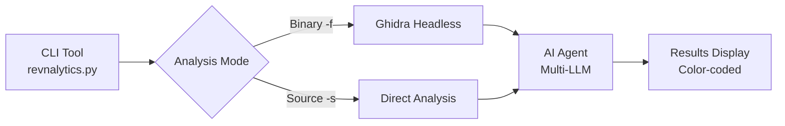

<div align="center">

# 🔬 REVNALYTICS

[](https://www.python.org/downloads/)
[](https://ghidra-sre.org/)
[](https://opensource.org/licenses/MIT)
[]()

**AI-Powered Binary & Source Code Security Analysis Tool**

*Combine the power of Ghidra reverse engineering with multi-LLM AI analysis to identify vulnerabilities and reverse engineering leverage points.*

[Features](#-features) •
[Installation](#-quick-start) •
[Usage](#-usage) •
[Documentation](#-configuration) •
[Contributing](#-contributing)

</div>

---

## 📖 Overview

REVNALYTICS is a command-line security analysis tool that combines **Ghidra reverse engineering** with **AI-powered vulnerability detection**. Analyze binaries and source code to identify security vulnerabilities, reverse engineering leverage points, and get detailed assessments with CWE classifications.

## ✨ Features

| Feature | Description |
|---------|-------------|
| 🔍 **Binary Analysis** | Deep analysis using Ghidra headless mode with function decompilation |
| 📝 **Source Code Analysis** | Direct AI-powered vulnerability scanning for C, C++, Python, and more |
| 🤖 **Multi-LLM Support** | Automatic fallback across OpenAI, Perplexity, DeepSeek, Mistral, and Hugging Face |
| 🎯 **Reverse Engineering Focus** | Identifies leverage points for security research (crash points, comparison gates, crypto functions) |
| 🎨 **Color-Coded Output** | Terminal output with ANSI colors for easy vulnerability identification |
| 📋 **CWE Classification** | Maps vulnerabilities to Common Weakness Enumeration standards |

## 🏗️ Architecture



<details>
<summary>📊 Text Architecture Diagram</summary>

```
┌───────────────┐     ┌─────────────────┐     ┌─────────────┐     ┌─────────────────┐
│   CLI Tool    │────▶│ Ghidra Headless │────▶│  AI Agent   │────▶│ Results Display │
│ (revnalytics) │     │  (Binary Mode)  │     │ (Multi-LLM) │     │  (Color-coded)  │
└───────────────┘     └─────────────────┘     └─────────────┘     └─────────────────┘
        │                                            ▲
        │             ┌─────────────────┐            │
        └────────────▶│ Direct Analysis │────────────┘
                      │  (Source Mode)  │
                      └─────────────────┘
```

</details>

## 📋 Prerequisites

| Requirement | Version | Notes |
|-------------|---------|-------|
| Python | 3.8+ | Required |
| Ghidra | 11.x | For binary analysis |
| LLM API Key | - | At least one recommended (OpenAI, Perplexity, DeepSeek, Mistral, or Hugging Face) |

## 🚀 Quick Start

### 1. Clone and Setup

```bash
git clone https://github.com/yourusername/REVNALYTICS.git
cd REVNALYTICS

# Install dependencies
cd backend
python3 -m venv venv
source venv/bin/activate
pip install -r requirements.txt
cd ..
```

### 2. Configure Environment

Create a `.env` file in the `backend/` directory:

```env
# Ghidra Configuration
GHIDRA_HOME=/path/to/ghidra_11.4.2_PUBLIC
GHIDRA_PROJECTS_DIR=/tmp/ghidra_projects
GHIDRA_TIMEOUT=600

# LLM API Keys (at least one recommended)
# Fallback order: OpenAI -> Perplexity -> DeepSeek -> Mistral -> Hugging Face -> Basic
OPENAI_API_KEY=your_openai_api_key_here
PERPLEXITY_API_KEY=your_perplexity_api_key_here
DEEPSEEK_API_KEY=your_deepseek_api_key_here
MISTRAL_API_KEY=your_mistral_api_key_here
HUGGINGFACE_API_KEY=your_huggingface_api_key_here
```

### 3. Run Analysis

```bash
# Make executable (optional)
chmod +x revnalytics.py

# Analyze a binary file
python revnalytics.py -f /path/to/binary

# Analyze source code directly
python revnalytics.py -s /path/to/source.c

# Save report to JSON
python revnalytics.py -f /path/to/binary -o report.json
```

## 🎯 Usage

### Command Line Options

```bash
usage: revnalytics.py [-h] (-f PATH | -s PATH) [-o PATH]

Revnalytics - Binary & Source Code Analysis Tool

options:
  -h, --help            show this help message and exit
  -f PATH, --file PATH  Path to the binary file to analyze (uses Ghidra)
  -s PATH, --source PATH
                        Path to source code file to analyze (C, C++, Python, etc.)
  -o PATH, --output PATH
                        Path to save the analysis report (JSON format)
```

### Examples

```bash
# Binary analysis with Ghidra
python revnalytics.py -f ./execution/test1

# Source code vulnerability scan
python revnalytics.py -s ./execution/testing_programs/vuln_buffer_overflow.c

# Analyze and save detailed report
python revnalytics.py -f suspicious.exe -o analysis_report.json

# Analyze Python source for vulnerabilities
python revnalytics.py -s webapp.py -o security_scan.json
```

### Sample Output

<details>
<summary>🖼️ Click to expand sample output</summary>

```
╔════════════════════════════════════════════════════════════════════════════════════════════════════════════╗
║                                                                                                            ║
║                                                                                                            ║
║           ██████╗ ███████╗██╗   ██╗███╗   ██╗ █████╗ ██╗  ██╗   ██╗████████╗██╗ ██████╗███████╗            ║
║           ██╔══██╗██╔════╝██║   ██║████╗  ██║██╔══██╗██║  ╚██╗ ██╔╝╚══██╔══╝██║██╔════╝██╔════╝            ║
║           ██████╔╝█████╗  ██║   ██║██╔██╗ ██║███████║██║   ╚████╔╝    ██║   ██║██║     ███████╗            ║
║           ██╔══██╗██╔══╝  ╚██╗ ██╔╝██║╚██╗██║██╔══██║██║    ╚██╔╝     ██║   ██║██║     ╚════██║            ║
║           ██║  ██║███████╗ ╚████╔╝ ██║ ╚████║██║  ██║███████╗██║      ██║   ██║╚██████╗███████║            ║
║           ╚═╝  ╚═╝╚══════╝  ╚═══╝  ╚═╝  ╚═══╝╚═╝  ╚═╝╚══════╝╚═╝      ╚═╝   ╚═╝ ╚═════╝╚══════╝            ║
║                                                                                                            ║
║                                                                                                            ║
╚════════════════════════════════════════════════════════════════════════════════════════════════════════════╝

[*] Mode: Binary Analysis (Ghidra)
[*] Starting analysis of: vulnerable_app
[+] Ghidra analysis completed successfully
[+] AI analysis completed

🎯 REVERSE ENGINEERING LEVERAGE POINTS:
   Found 3 interesting target(s):

   ┌─[1] check_password @ 0x00401234
   │  Type: Comparison Gate
   │  CWE: CWE-798
   │  Why Interesting: Hardcoded password comparison using strcmp
   │  Reverse Strategy: Patch JNZ to JMP or extract password from binary
   └────────────────────────────────────────────────────────

🔥 RECOMMENDED FOCUS:
   Start with check_password function - contains authentication bypass opportunity
```

</details>

## 📁 Project Structure

<details>
<summary>📂 Click to expand project structure</summary>

```
REVNALYTICS/
├── revnalytics.py              # Main CLI entry point
├── README.md                   # This file
├── SETUP.md                    # Detailed setup guide
├── LICENSE                     # MIT License
├── backend/
│   ├── __init__.py
│   ├── ai_agent.py             # Multi-LLM AI integration
│   ├── ghidra_integration.py   # Ghidra headless wrapper
│   ├── prompt_manager.py       # AI prompt management
│   └── requirements.txt        # Python dependencies
├── ghidra_scripts/
│   └── extract_functions.py    # Ghidra analysis script
├── ai_agent_prompts/
│   └── merged_prompt.txt       # AI prompt templates
├── execution/                  # Test binaries
│   ├── test1, test2, ...       # Compiled test programs
│   └── testing_programs/       # Source code for test binaries
│       ├── vuln_buffer_overflow.c
│       ├── vuln_sql_injection.py
│       └── ...                 # Various vulnerability examples
└── ghidra_11.4.2_PUBLIC/       # Ghidra installation (optional)
```

</details>

## 🔧 Configuration

### Ghidra Settings

| Environment Variable | Default | Description |
|---------------------|---------|-------------|
| `GHIDRA_HOME` | - | Path to Ghidra installation |
| `GHIDRA_PROJECTS_DIR` | `/tmp/ghidra_projects` | Temporary project directory |
| `GHIDRA_TIMEOUT` | `600` | Analysis timeout in seconds |

### Supported Languages (Source Mode)

| Extension | Language |
|-----------|----------|
| `.c`, `.h` | C |
| `.cpp`, `.cc`, `.hpp` | C++ |
| `.py` | Python |
| `.js`, `.ts` | JavaScript/TypeScript |
| `.go` | Go |
| `.rs` | Rust |
| `.java` | Java |
| `.php` | PHP |

## 📊 Analysis Output

### Leverage Point Types

| Type | Color | Description |
|------|-------|-------------|
| Crash Leverage | 🔴 Red | Buffer overflows, use-after-free |
| Arithmetic Constraint | 🟣 Magenta | Integer overflows, format strings |
| Comparison Gate | 🟡 Yellow | Authentication bypasses, license checks |
| Environment Gate | 🔵 Blue | Environment variable manipulation |
| Crypto Leverage | 🔵 Cyan | Weak cryptography, hardcoded keys |
| Input Handler | 🟢 Green | User input processing points |

### Output Includes

- **Summary**: High-level analysis overview
- **Function Count**: Total functions analyzed
- **Call Flow**: Entry point and call relationships
- **Reverse Leverage Points**: Security-relevant functions with:
  - Function name and address
  - Vulnerability type and CWE classification
  - Assembly/code evidence
  - Exploitation strategy
- **Recommended Focus**: Where to start your analysis

## 🛡️ Security Features

- ✅ File size limits (max 100MB)
- ✅ Timeout protection for analysis
- ✅ Secure temporary file handling
- ✅ Input path validation
- ✅ Error handling and graceful degradation

## 🐛 Troubleshooting

<details>
<summary>❓ Ghidra Not Found</summary>

```bash
# Verify GHIDRA_HOME is set
echo $GHIDRA_HOME

# Check analyzeHeadless exists
ls $GHIDRA_HOME/support/analyzeHeadless
```

</details>

<details>
<summary>⏱️ Analysis Timeout</summary>

- Increase timeout: `GHIDRA_TIMEOUT=1200` (20 minutes)
- Large binaries (>50MB) may need more time

</details>

<details>
<summary>🤖 AI Analysis Issues</summary>

- Verify API key in `backend/.env`
- System automatically tries fallback providers
- Falls back to rule-based analysis if all providers fail

</details>

## 📝 License

This project is licensed under the MIT License - see the [LICENSE](LICENSE) file for details.

## 🤝 Contributing

Contributions are welcome! Here's how you can help:

1. **Fork** the repository
2. **Create** a feature branch (`git checkout -b feature/amazing-feature`)
3. **Commit** your changes (`git commit -m 'Add amazing feature'`)
4. **Push** to the branch (`git push origin feature/amazing-feature`)
5. **Open** a Pull Request

### Areas for Contribution

- 🐛 Bug fixes and improvements
- 📝 Documentation enhancements
- 🔌 New LLM provider integrations
- 🧪 Additional test cases and vulnerability samples
- 🌐 Multi-language support

## ⭐ Star History

If you find this project useful, please consider giving it a star! ⭐

## 🙏 Acknowledgments

- [Ghidra](https://ghidra-sre.org/) by NSA - Reverse engineering framework
- [OpenAI](https://openai.com/), [Perplexity](https://www.perplexity.ai/), [DeepSeek](https://www.deepseek.com/), [Mistral](https://mistral.ai/), [Hugging Face](https://huggingface.co/) - AI capabilities

---

<div align="center">

**Made for security researchers and reverse engineers**

</div>
